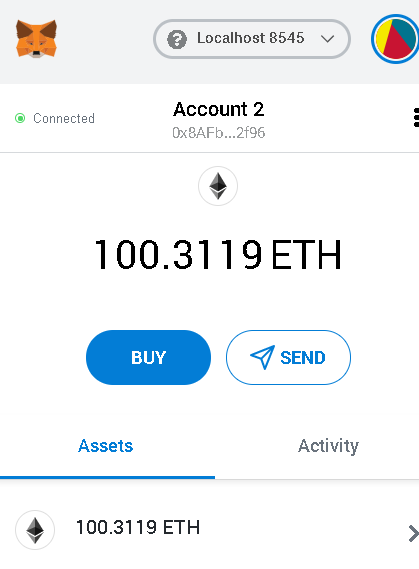
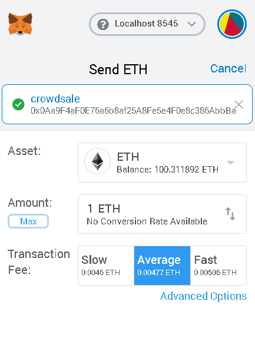

Three solidity contracts were written to create a cryptocurrency called "Puppercoin"

## Background

Your company has decided to crowdsale their PupperCoin token in order to help fund network development.

This network will be used to track the dog breeding activity across the globe in a decentralized way, and allow humans to track the genetic trail of their pets. You have already worked with the necessary legal bodies and have the green light on creating a crowdsale open to the public. However, you are required to enable refunds if the crowdsale is successful and the goal is met, and you are only allowed to raise a maximum of 300 Ether. The crowdsale will run for 24 weeks.

You will need to create an ERC20 token that will be minted through a `Crowdsale` contract that you can leverage from the OpenZeppelin Solidity library.

This crowdsale contract will manage the entire process, allowing users to send ETH and get back PUP (PupperCoin).
This contract will mint the tokens automatically and distribute them to buyers in one transaction.

Puppercoin parameters:

symbol: PUPP
cap: 30 coins
total offering:300

To participate in the offering you would use metamask to send ether which will be converted to PupperCoins.

